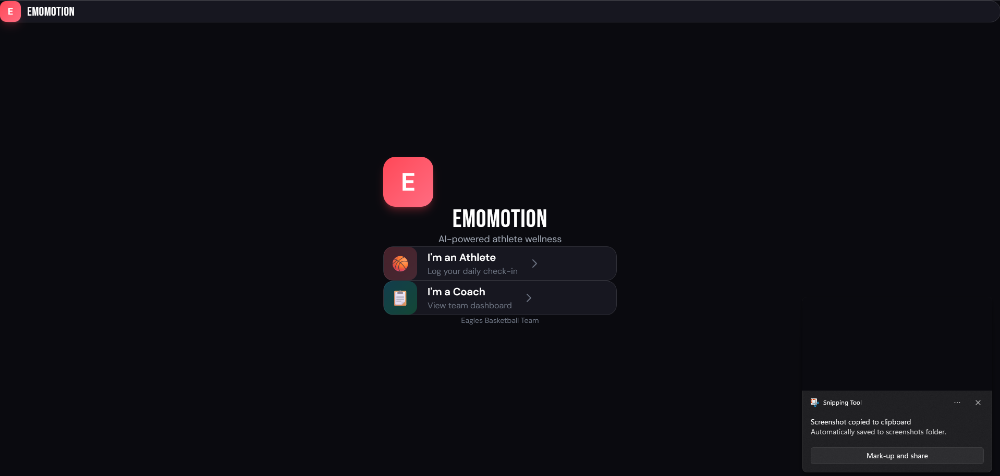
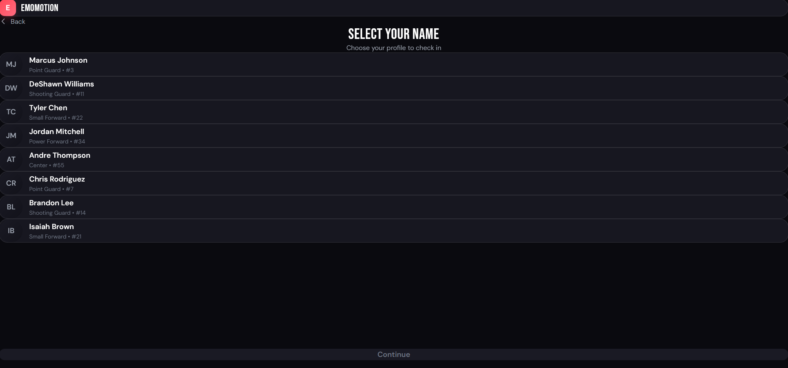
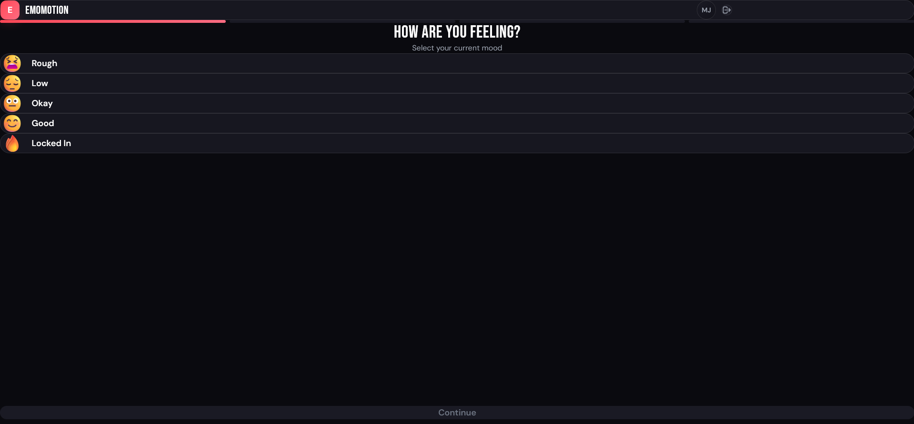
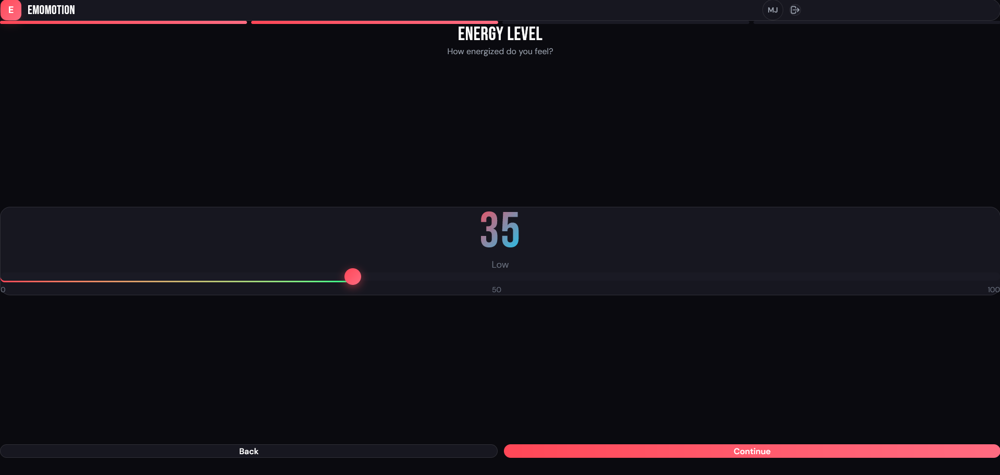
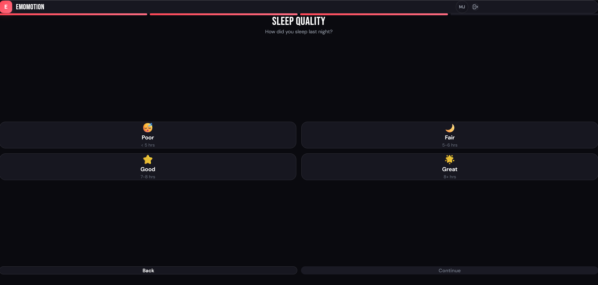
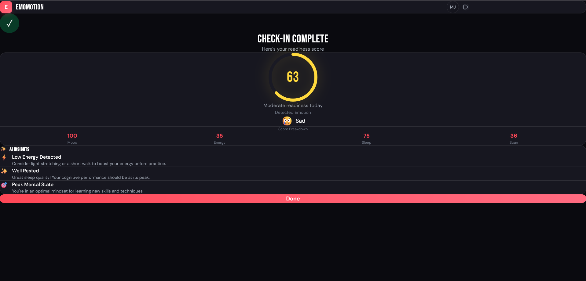
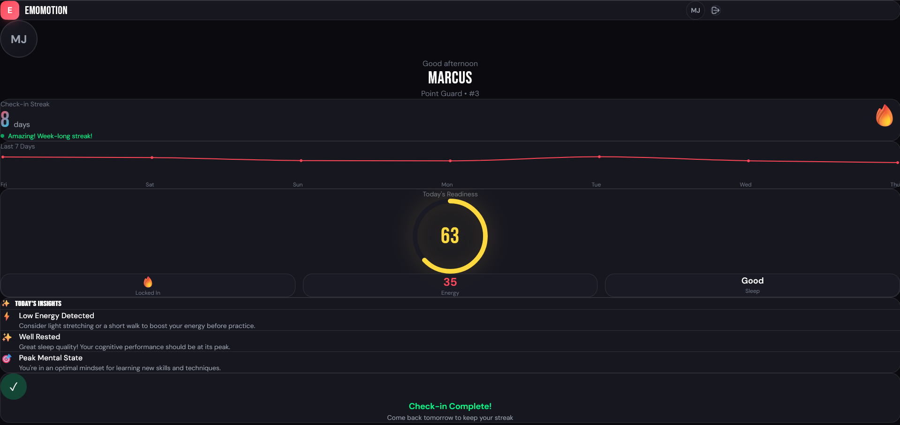
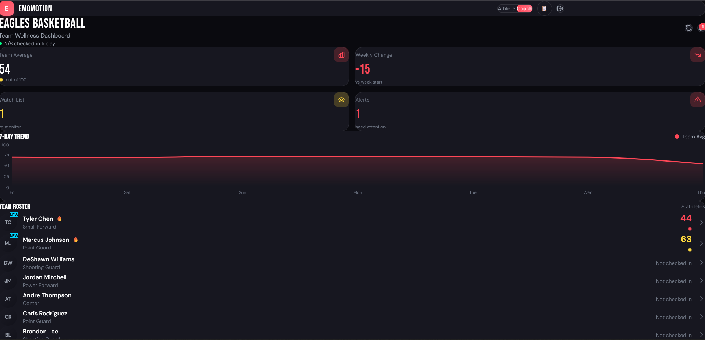

# EmoMotion — AI-Powered Athlete Emotion Detection

**Live Demo:** https://emomotion.vercel.app/

The first AI platform that gives coaches a daily emotional readout of every athlete on their roster.

## Try It Now

**Athlete Login:** Select any athlete name from the roster
**Coach Login:** Use code `EAGLES2024`

## Screenshots

### Login & Athlete Selection
<p align="center">
  
  
</p>

### Daily Check-in Flow
<p align="center">
  
  
  
</p>

### Results & Insights
<p align="center">
  
  
</p>

### Coach Dashboard
<p align="center">
  
</p>

## Features

### For Athletes
- 60-second daily check-in
- Mood, energy, and sleep tracking
- AI-powered insights
- Personal wellness trends
- Streak tracking for consistency

### For Coaches
- Real-time team wellness dashboard
- Color-coded athlete status (Green 70+, Yellow 50-69, Red <50)
- Watch list and alert system
- 7-day trend analysis
- Individual athlete deep-dives

## Tech Stack

- **Frontend:** React + Vite + Tailwind CSS
- **Charts:** Recharts
- **Routing:** React Router
- **Deployment:** Vercel
- **State:** React Context + localStorage

## Getting Started

```bash
git clone https://github.com/jlamm123/EmoMotion.git
cd EmoMotion
npm install
npm run dev
```

Open http://localhost:5173

## Coming Soon

- [ ] Real facial emotion detection (TensorFlow.js)
- [ ] PWA support (install on mobile)
- [ ] Push notifications
- [ ] Supabase backend
- [ ] Team management
- [ ] Stripe payments

## Author

**Justin Lam** — Cybersecurity Engineer & AI Developer
- Sheridan College (Honours Bachelor of Information Sciences)
- Cloud Solutions Analyst @ Sun Life Financial
- [LinkedIn](https://linkedin.com/in/justinnlam)

---

**The edge is mental.**
